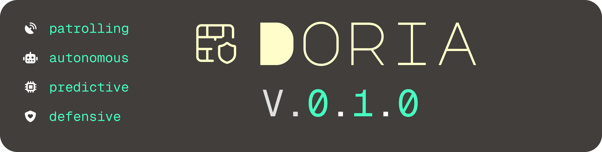

> *Doria*; Swahili for **patrol**.

Doria is an AI powered supply chain security agent that sits in your CI/CD pipeline and acts as a drop-in replacement for your package manager. It scans every dependency at install time, reasons about risk in context, catches AI hallucinated package names, and autonomously fixes critical threats before they ever touch your codebase.

--

🏆 **Winner — ITWeb Security Summit Hackathon 2026 (#SS26HACK)** · 1st place out of 850+ participants · [Coverage on ITWeb](https://www.itweb.co.za/article/team-doria-wins-sshack26/4r1ly7R95KPvpmda)

---


## The Problem

Modern software is built on trust. Every `npm install` or `pip install` pulls in dozens of third-party packages, any one of which could be malicious, compromised, or actively exploited.

With AI-assisted development becoming mainstream, the attack surface has expanded dramatically. Developers are now installing packages suggested by AI tools without verifying them. Researchers tested 16 LLMs across 576,000 code samples and found that **1 in 5 AI-suggested packages do not exist**. Attackers register those names and wait.

This is called **slopsquatting**. No commercial tool catches it. Doria does.

---

## How It Works

Doria has four detection layers:

| Layer | What It Does |
|-------|-------------|
| **Layer 1 — Static Analysis** | Parses package source code using a real AST parser (not regex). Detects shell execution, network calls, credential harvesting, obfuscated code, and malicious install hooks. |
| **Layer 2 — ML Threat Intelligence** | Cross-references findings against live threat intel and a trained XGBoost scoring model built on real malware datasets. |
| **Layer 3 — LLM Reasoning** | Takes raw signals from Layers 1 and 2 and reasons about them in the context of your specific codebase. Tells you exactly which line is vulnerable and why it matters. |
| **Layer 4 — Slopsquatting Detection** | Intercepts AI-generated dependency suggestions before they land. Detects hallucinated package names, cross-ecosystem confusion, and packages registered suspiciously close to when the hallucination was first observed. |

When a critical threat is confirmed, Doria does not alert and wait. It acts:
- Removes the malicious package
- Pulls the latest safe version
- Runs your test suite
- Opens a PR with a full explanation
- Notifies your team via Slack

---

## The CLI

Doria ships as a drop-in replacement for your package manager:
```bash
doria install <package>
```

The install is intercepted, scanned, and either passed through safely or blocked with an explanation. The intervention point moves from CI to before the package ever touches your machine.

---

## Repository Structure
```
DORIA/
  doria-cli/      Rust — AST scanning engine and CLI binary
  doria-engine/   Python — ML model, LLM reasoning, autonomous agent
  doria-web/      React + Next.js — dashboard and landing page
  test-env/       Local test environment with real packages for manual testing
```

---

## Workspace Setup

### Prerequisites
- Rust (latest stable) — https://rustup.rs
- Python 3.11+
- Node.js 20+

### Rust engine
```bash
cd doria-cli
cargo build
cargo test
```

### Python agent
```bash
cd doria-engine
python -m venv .venv
source .venv/bin/activate
pip install -r requirements.txt
```

### Dashboard
```bash
cd doria-web
npm install
npm run dev
```

---

## Manual Scanner Testing

To scan a real package against the Rust engine:
```bash
cd doria-cli
cargo run -p doria-core --bin scan_test -- ../test-env/node_modules/<package> <name> <version>
```

Example:
```bash
cargo run -p doria-core --bin scan_test -- ../test-env/node_modules/nanoid nanoid 5.0.0
cargo run -p doria-core --bin scan_test -- ../test-env/soph-mal sophisticated-mal 2.1.4
cargo run -p doria-core --bin scan_test -- ../test-env/obfuscated-mal obfuscated-mal 1.0.3
```

---

## Team

| Member | Role |
|--------|------|
| Elvis | Rust Engine |
| Mphele | ML Engine |
| Aphiwe | Dashboard |

---

## Status

| Component | Status |
|-----------|--------|
| Rust AST engine | done |
| ML scoring model | done |
| LLM reasoning layer | done |
| Slopsquatting detector | done |
| React dashboard | done |
| Landing page | pending |
| CLI binary | done |
| Autonomous remediation | done |

---

